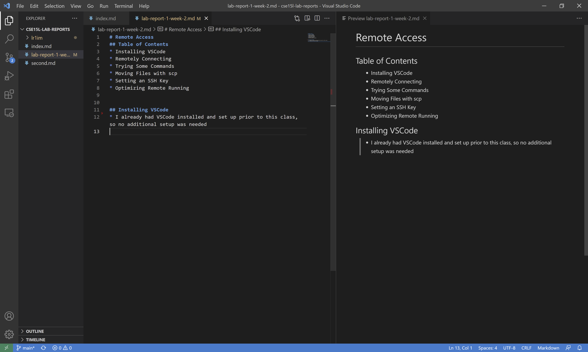

# Remote Access
## Table of Contents
* Installing VSCode
* Remotely Connecting
* Trying Some Commands
* Moving Files with `scp`
* Setting an SSH Key
* Optimizing Remote Running


## Installing VSCode

* I already had VSCode installed and set up prior to this class, so no additional setup was needed

## Remotely Connecting
* By using `ssh`, we can remotely connect to another computer (the server)
* Since I'm on Windows, I started by [installing OpenSSH](https://docs.microsoft.com/en-us/windows-server/administration/openssh/openssh_install_firstuse)
* To connect to a UCSD computer, I used the following command in my VSCode Terminal: \
        ```
        $ ssh cs15lwi22acy@ieng6.ucsd.edu
        ```
* This is what I see upon connecting with `ssh`:

* I use Ctrl+d to disconnect from the remote computer

## Trying Some Commands
* We also tried several commands on both local and remote computers
* `cd`:
    
    * `cd ~`: return to home directory
    * `cd ..`: go back one directory on the current path
    * `cd <directory name>`: go to specified directory
* `ls`: lists files and directories in current directory
    
    * `ls -l`: lists in longer format with additional information
    * `ls -a`: lists all files and directories, including hidden ones
    * `ls <directory>`: lists files and directories in specified directories
        * permissions restrict access to other people's directories
* `cp <source file> <destination file>`: copies the source file into the destination file (overwrites or creates a new file)
    * `cp <file 1> <file 2> <file 3> <directory>`: copies all files into the specified directory with the same name (will overwrite existing files)
* `cat <file>`: prints the contents of the specified file
    
    * works with multiple files and will print them in order
## Moving Files with `scp`

* `scp <file> <server>`: copies files and directories from the client to the remote computer
* Also included in this screenshot is the result of running WhereAmI.java on the server, which printed information about the server rather than the client

## Setting an SSH Key
* SSH keys help us connect to the remote computer more efficiently, as it removes the need to type a password each time
* Steps to set up an SSH key:
    * `ssh-keygen`: generates a private and public key
    * As I'm on Windows, I also needed to follow some [additional steps](https://docs.microsoft.com/en-us/windows-server/administration/openssh/openssh_keymanagement#user-key-generation)
    * Connect to the server (`ssh`)
    * `mkdir .ssh`: creates a directory named `.ssh`
    * Disconnect from the server
    * `scp <location of public key> <server>:~/.ssh/authorized_keys`: copies public key to the server
    * Now we don't need a password to connect to the server!
    \
    \
    


## Optimizing Remote Running
* To make running commands on the server more efficient, we can use:
    * `ssh <server> <command>`: connects to the server, runs the command, then disconnects
    
    * Note: `ssh <server> <command>; <command>` will run the first command on the server and the second on the client. To run multiple on the server, contain the commands in quotes: \
    `ssh <server> '<command>; <command>'`
    